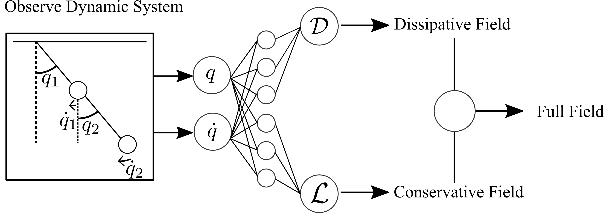
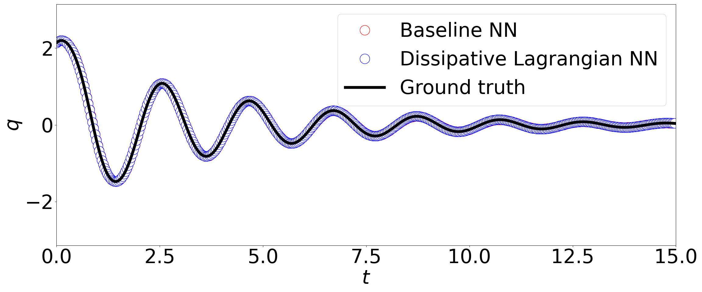
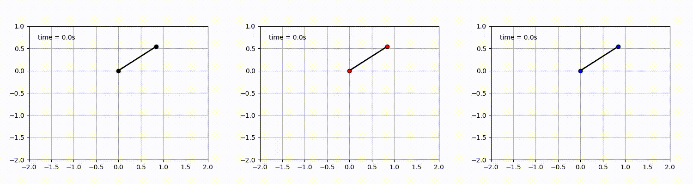
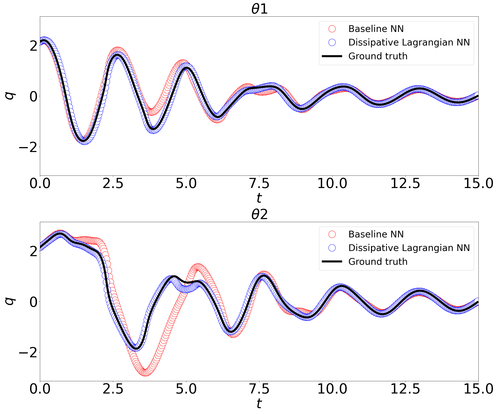
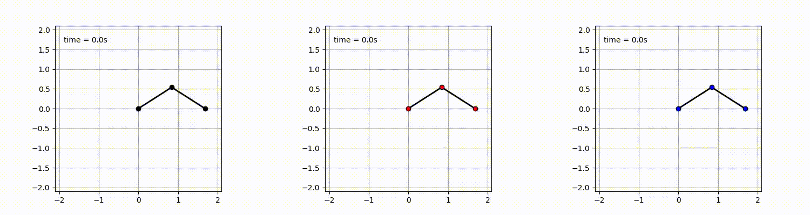

# Dissipative Lagrangian Neural Networks

Takemori Masaki,Kamakura Yoshinari|2023
Code for our paper "Learning of Mechanical System Dynamics with Dissipative Lagrangian Neural Networks"

 

 

Dissipative Lagrangian Neural Networks(D-LNN) predicts two scalar functions,Dissipative(**D**) and Lagrangian(**L**).
**L** is Lagrangian.This is conserved.
**D** is Rayleigh dissipation.This is dissipative component of the dynamics of physical system.
This model was constructed with reference to Lagrangian Neural Networks([Paper](https://arxiv.org/abs/2003.04630),[github](https://github.com/MilesCranmer/lagrangian_nns)) and Dissipative Hamiltonian Neural Networks([Paper](https://arxiv.org/abs/2201.10085),[github](https://github.com/DrewSosa/dissipative_hnns)). D-LNN doesn't rely on canonical coordinate systems and be able to consider dissipation.

---
## Sample
### Pendulum

### Double Pendulum

---
## Basic usage
Analyze:use the .ipynb(jupyter notebooks). \
Train:run experiment-*/train.py. 

---
## Enviroment
Python 3.8.10 \
Pytorch 1.13.1

NVIDIA-SMI 527.92.01 \
Driver Version 528.02 \
CUDA Version 12.0

---
## Summary
Systems using Neural Network have made remarkable progress. However, understanding mechanical system dynamics, where intuitive understanding is important, is difficult.
In research, Greydanus et al. proposed Dissipative Hamiltonian Neural Networks (D-HNN), which can automatically model the canonical equations of dissipative dynamical systems, and Cranmer et al. proposed Lagrangian Neural Networks (LNN), which can automatically model mechanical system dynamics based on the Lagrange equation.
We construct a neural network model called Dissipative Lagrangian Neural Networks (D-LNN), which can predict mechanical systems with dissipation based on the Lagrange equation using the generalized coordinates that are easy to acquire and do not require difficult canonical momentum.